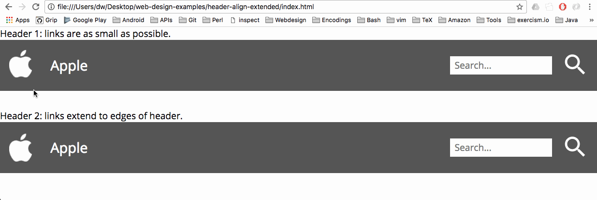

# Header Align Extended

An example of laying out typical elements in a website header using the CSS3 **[flexbox](https://www.w3schools.com/css/css3_flexbox.asp)** (flexible box) layout mode.

This is an extension of [Header Align](https://github.com/weibeld/webdesign-header-align).

## Live Demo

[Click here](https://weibeld.github.io/webdesign-header-align-extended/)

## Recorded Demo

## Summary

There are two versions of the example header. In **Header 1**, the links encompass only the visible content, and not more, whereas in **Header 2**, the links extend to the top and bottom of the header.

Both versions can be achieved with flexbox layouts, however, the groups and elements need to be laid out sligtly different, most importantly, along the options `align-items: stretch` vs `align-items: center`, and `padding` vs `margin`.

### Define a "left group" and a "right group"

The most important part is to group the elements which need to be aligned on the left or right side, respectively, of the header, so that these groups are immediate children of the header (`#hd-X-left` and `#hd-X-right`).

Then the header itself is declared a **flex container** by setting `display: flex`. This causes the "left group" and "right group" to be its **flex items**. We want one flex item at the left edge and one at the right edge of the header, so we set [`justify-content: space-between`](https://www.w3schools.com/cssref/playit.asp?filename=playcss_justify-content&preval=space-between) in the header element:

~~~css
header {
  display: flex;
  justify-content: space-between;
}
~~~

### Align content in each group separately

Then, the content of the two groups at the left and right edge of the header is laid out using a flexbox layout as well.

Note that the default value for [`justify-content`](https://www.w3schools.com/cssref/css3_pr_justify-content.asp) is [`flex-start`](https://www.w3schools.com/cssref/playit.asp?filename=playcss_justify-content&preval=flex-start), which is always fine for our example, so we don't overwrite the default value.

The default value of [`align-items`](https://www.w3schools.com/cssref/css3_pr_align-items.asp) is [`stretch`](https://www.w3schools.com/cssref/playit.asp?filename=playcss_align-items&preval=stretch), which is fine for some cases, for example, if we want the contained links to stretch to the full height of the header (as in `#hd-2-left`).

In other cases, if we want the contained elements to just "float" in the vertical middle, we set [`align-items: center`](https://www.w3schools.com/cssref/playit.asp?filename=playcss_align-items&preval=center).

## References

- Header Align
    - <https://github.com/weibeld/webdesign-header-align>
- Flexbox
    - <https://www.w3schools.com/css/css3_flexbox.asp>
    - <https://developer.mozilla.org/en-US/docs/Web/CSS/CSS_Flexible_Box_Layout>
    - <https://css-tricks.com/snippets/css/a-guide-to-flexbox/>
- Approaches to center things
    - <https://www.w3.org/Style/Examples/007/center.en.html>
